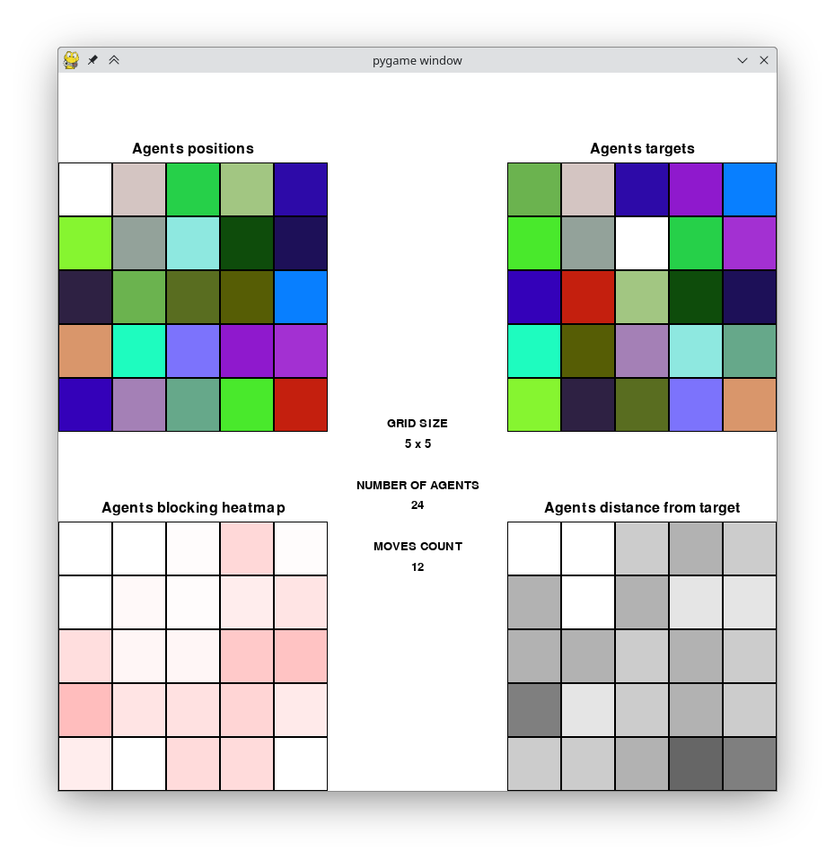

# mystic-square
This project is a multi-agent mystic-square game solver. Each tile is autonomous and try to reach its final destination. Agents can:
- Move if the destination cell is empty (white)
- Request other tiles to move if they block them



## Installation
This project uses [Nix](https://nixos.org/) with [flakes enabled](https://nixos.wiki/wiki/Flakes) as environment manager.

## Usage
Assuming you are at `mystic-square` root.

```bash
python src/main.py
```

## This project is part of my engineering school curriculum
[](https://cytech.cyu.fr/)